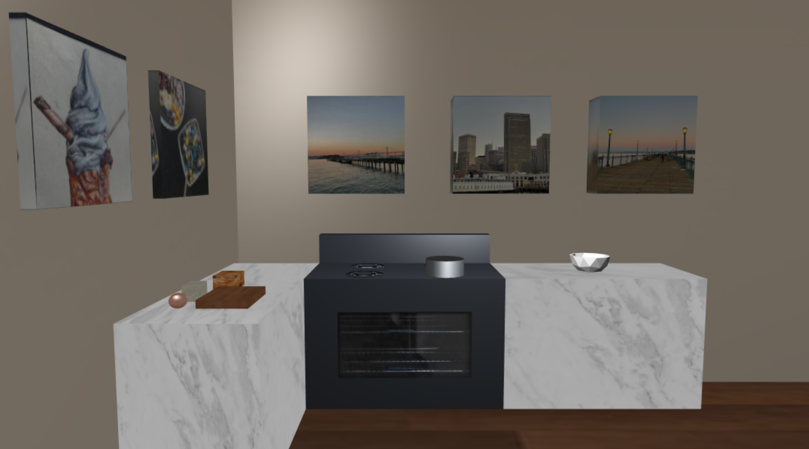
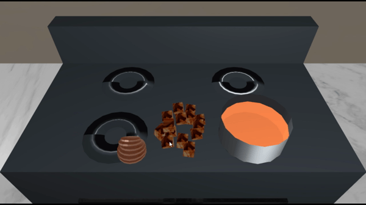
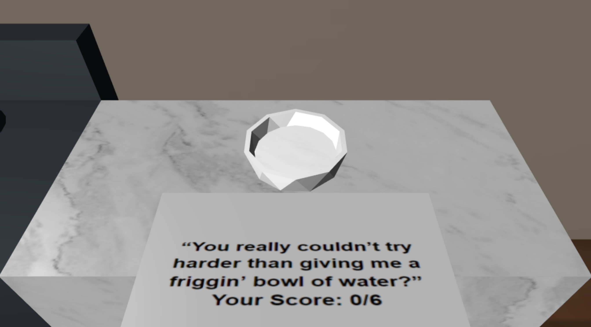
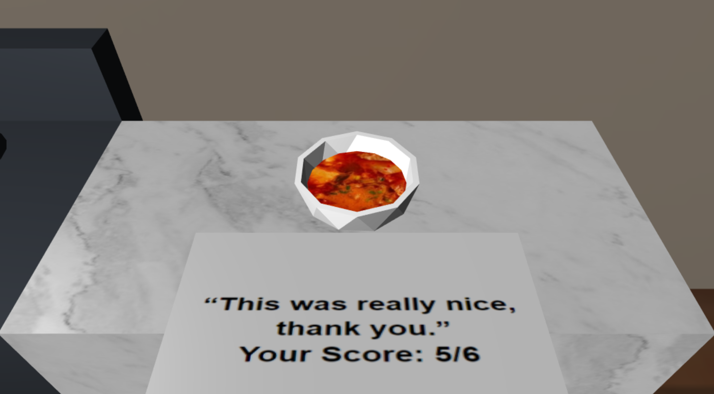

# Cooking Daddy
Final project made for UCLA COM SCI 174A: Intro to Computer Graphics at UCLA

Team Members:
* Annie Chen
* Joyce Kang
* Bryan Wong

### Story and Design

Based on the popular title, Cooking Mama, Cooking Daddy is an interactive kitchen scene and minigame where the user can interact with items on the counter to ultimately create a dish that they are scored on. In our game, you are cooking kimchi jjigae to impress your significant other because they are mad at you. Don't mess up or else your relationship may end!

Key-triggered buttons are used to move through the specific stages of the game and to control your mouse function
* (m) Move Ingredients
* Functions as a toggle. This allows you to drag ingredients around the scene
* (c) Chop Ingredients
* Functions as a toggle. This allows you to chop ingredients in Stage 1. Only works if ingredients are on the chopping board.
* (Control+0) Start 
* (Control+1) Stage 1: Prep the Ingredients
* (Control+2) Stage 2: Make the soup
* (Control+3) Stage 3: Plate everything

### Stages 
1. Stage 1: Prep the Ingredients 
    * The user must chop each ingredient into smaller pieces.
    * Press (m) and then click and drag the ingredients to move them onto the cutting board.
    * Press (c) and then click on the ingredients to chop them.
    
    
    
2. Stage 2: Make the Soup
    * The user must drag and drop each ingredient into the pot to cook the stew.
    * Press (m) and then click and drag the ingredients to move them into the pot.
    
    
    
3. Stage 3: Plating Everything
    * The user will be scored on their dish depending on how many tasks they complete. 
    * Each item the user chops into pieces is worth one point, and each item the user drops into the pot is worth one point.
    
    
    
    

### Advanced Features 
* Collision Detection
* Raycasting
* Mouse-Picking

### How to Run
Run a local server and navigate to /team-project-cooking-daddy/index.html

### Technologies Used 
* [tiny-graphics-js library](https://github.com/encyclopedia-of-code/tiny-graphics-js)

### References
* [Collision Detection](https://developer.mozilla.org/en-US/docs/Games/Techniques/3D_collision_detection )
* [Raycasting](https://antongerdelan.net/opengl/raycasting.html)
* [Ray-box intersection](https://antongerdelan.net/opengl/raycasting.html)
* [Ray-plane intersection](https://www.scratchapixel.com/lessons/3d-basic-rendering/minimal-ray-tracer-rendering-simple-shapes/ray-plane-and-ray-disk-intersection)

